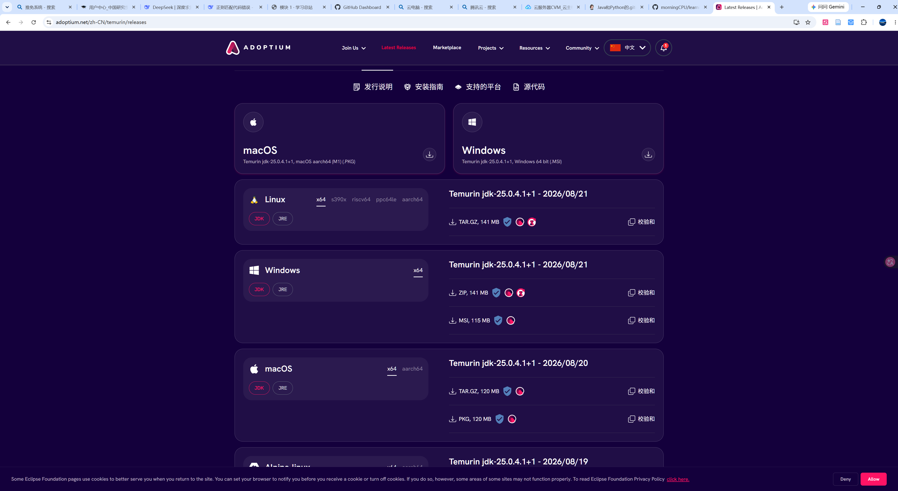
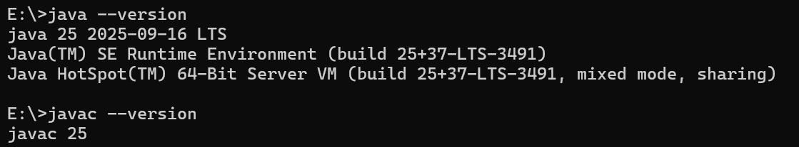
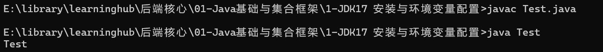
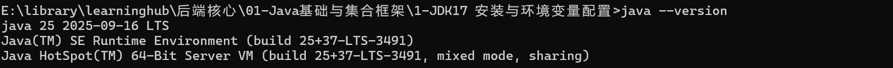
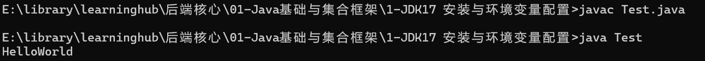

# 1- JDK17安装与环境配置

## 一、学什么

> 1. JDK/JRE/JVM三者的关系
> 2. JDK的安装
> 3. JAVA_HOME与Path环境变量的作用

## 二、做什么

### 2.1 安装与使用

**1. 下载**    
打开 <https://adoptium.net/> 下载 Temurin 17（Windows x64 的 .msi 或 .zip；也可到 oracle.com 下载 Oracle JDK17），安装/解压到想要的位置 `D:\dev\jdk-17`（路径不要带空格和中文）  


**2. 配置环境变量**  
设置 -> 系统 -> 关于 -> 高级系统设置 -> 环境变量  
新建系统变量 `JAVA_HOME=D:\dev\jdk-17`  
编辑 `Path` 新增一行 `%JAVA_HOME%\bin`，逐一点确定保存  

+ **这里有一个问题为什么path不能直接写而是要搞一个JAVA_HOME呢？**  
  path可以直接写完整路径   
  配置系统变量JAVA_HOME的作用是，其他的软件应用如果想要调用java的服务的话，那他们会通过JAVA_HOME进行寻找，这是规定好的，如果没有配置JAVA_HOME的话那他们就找不到    

**3. 测试**    
依次敲 `java -version` 与 `javac -version`，确认输出 `openjdk version "17.0.x"` 和 `javac 17.0.x`  
其中java是负责运行的，javac是负责编译的   
注意这里如果你先前打开了一个命令行窗口要重新开一个新的，不然没有配置的环境变量信息   
  

**4. 使用**  
下面写一个test.java文件进行测试   
这里有两个点需要注意：    
1.一个.java文件中只能有一个public类    
2.在这个文件中文件名要和这个public类的类名一样，不然会编译失败     
```java
public class Test{
	public static void main(String[] args){
		System.out.println("Test");
	}
}
```  
使用 `javac Test.java` 进行编译生成Test.class  
使用 `java Test` 进行运行   
    

### 2.2 基础知识  

**1. JDK、JRE、JVM** <a name="point1" href="#point1-back" style="color:sky;text-decoration:none">返回链接</a>  
JDK : Java Develop Kit - Java开发工具包  
JRE : Java Runtime Environment - Java运行时环境   
JVM : Java Virtual Machine - Java虚拟机  

JDK ⊃ JRE ⊃ JVM  
JDK提供编译开发工具，JRE提供运行环境，JVM执行字节码  

**JDK**：JRE+开发工具集(javac编译器，jdb调试器，javadoc，jar打包工具等)  
**JRE**：给已经编译好的class程序用，JVM+java核心类库，如果只用跑Java程序的话，那下载JRE就可以了  
**JVM**：执行字节码.class，JVM本身不是跨平台的，每一个平台有自己的JVM，同时要配合类库才能跑程序，单独的JVM不能跑程序，负责加载class文件、内存管理、垃圾回收、字节码翻译成当前操作系统机器码  

**2. JDK17的三个特性** <a name="point2" href="#point2-back" style="color:sky;text-decoration:none">答案链接</a>  

**(1) sealed Classes**  
封闭类  
用于控制继承：限定哪些类/接口可以继承或者实现当前类，不再只有final（完全不能继承）和普通类（所有人都可以继承）  
关键字：`sealed` 、 `permits` 、 `final` 、 `non-sealed`   
```java
sealed interface Fruit permits Apple,Banana{}
final class Apple implements Fruit{}
non-sealed calss Banana implements Fruit{}
```  

**(2) switch 表达式**  
使用 `->` 语法默认不会穿透，需要返回值用 `yield`  
```java
// 旧写法（switch语句，容易case穿透）
int num = 3;
String res;
switch(num){
    case 1: res="一";break;
    case 2: res="二";break;
    default: res="其他";
}

// JDK17 switch表达式，返回值，->无穿透
String res = switch (num) {
    case 1 -> "一";
    case 2 -> "二";
    default -> "其他";
};

// 如果case内部有多行代码，用yield返回
String res2 = switch (num) {
    case 1 -> {
        System.out.println("case1");
        yield "一";
    }
    default -> "其他";
};
```  

**(3) text blocks**  
文本块  
使用三个双引号包围 `"""`   
```java
// 传统字符串，需要大量换行转义
String jsonOld = "{\n" +
                 "  \"name\":\"test\"\n" +
                 "}";

// Text Block文本块
String json = """
    {
        "name":"test"
    }
    """; //由两个较左边的控制左边的开始位置
```  

## 三、验收  

### 3.1 查看java版本  
`java --version`  
  

### 3.2 编译运行HelloWorld  
Test.java  
```java
public class Test{
  public static void main(String[] args){
    System.out.println("HelloWorld");
  }
}
```

  

### 3. 讲解一下JDK、JRE、JVM的关系  
<a name="point1-back" href="#point1" style="color:sky;text-decoration:none">答案链接</a>  

## 四、问题   

**1. JDK、JRE、JVM 有什么区别？**  

<a name="point1-back" href="#point1" style="color:sky;text-decoration:none">答案链接</a>  
 
**2. JDK17有哪些新特性**  

<a name="point2-back" href="#point2" style="color:sky;text-decoration:none">答案链接</a>   
