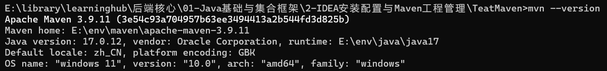

# 2-IDEA安装配置与Maven工程管理  

## 一、学什么  

> 1. IDEA常用设置与高频快捷键   
> 2. Maven核心概念（坐标、仓库、生命周期）   
> 3. 如何使用镜像仓库   


## 二、做什么      

### 2.1 Intellij IDEA    

到 jetbrains.com 下载安装 IntelliJ IDEA（Community 版即可），首次启动按向导完成基础配置（主题、JDK 选择）。      

### 2.2 Maven  

**1.下载**     
下载 Maven 3.9.x（maven.apache.org → Download → Binary zip archive），解压到 `D:\dev\maven`，配置 `MAVEN_HOME` 与 `Path`，**新开**终端敲 `mvn -v`，确认输出 `Apache Maven 3.9.x` 与 JDK 版本。  
注意这里就体现了前一节JAVA_HOME的作用了，这里使用的java就是JAVA_HOME设置的  

**2. 配置镜像(当然可以不配置)**   
编辑 `%MAVEN_HOME%\conf\settings.xml`：在 `<mirrors>` 节点内添加阿里云镜像     

```xml
<mirror>
	<id>aliyun-maven</id>
	<mirrorOf>central</mirrorOf>
	<url>https://maven.aliyun.com/repository/public</url>
</mirror>    
```

配置本地仓库目录 `localRepository `   

```xml
<localRepository>
	E:\env\maven\apache-maven-3.9.11\repo
</localRepository>
```

maven对使用的库会先从本地仓库找，找到再在网络下载，并会放到本地仓库中  

**3. 在IDEA中使用maven**   
IDEA 中 Settings → Build, Execution, Deployment → Build Tools → Maven，把 User settings file 指到上面改好的 settings.xml，然后 File → New → Project → Maven → 勾选 archetype `maven-archetype-quickstart`，新建一个工程，写一个输出 Hello 的 main 方法点绿色三角运行。   

+ 注意这个设置要设置在新项目设置，不然设置到不了新项目，设置的只是当前项目   

**4. maven使用**    
在终端对同一工程执行 `mvn clean package`，打开 `target/` 目录确认生成了 jar 包，理解   compile/test/package 生命周期顺序。  
**(1) mvn clean package的作用**   
这里其实是两个命令，先执行了clean，然后执行了package   
**clean:** 删除target目录内容 （编译产物，class文件，打包好的jar包）  
**package:** 执行默认构建生命周期，一直执行到package阶段为止。    
package阶段的工作是：把编译好的class文件、资源文件打包，生成jar或war，放到target文件夹    
**(2) compile、test、package**    

```txt
validata -> initialize -> generate-sources -> process-sources -> compile -> process-classes -> generate-resources -> process-resources -> test-compile -> process-test-classes -> test -> prepare-package -> package
```

**compile:** 编译阶段，编译主代码(src/main/java)，生成.class文件，输出到target/classes，只编译业务代码，不编译测试代码，不跑测试   
**test:** 测试阶段，先执行 test-compile编译测试代码(src/test/java)，class放到target/test-classes，然后执行test用JUnit运行单元测试，如果任意单元测试失败，整个构建直接终止，不会继续走到package打包   
**package:** 打包阶段，测试全部通过后，进入package，把target/classes的class、配置资源文件，打包成jar包，输出到target/*.jar   

先编译主代码(compile)，再编译测试代码，然后执行测试(test)，测试全部通过，最后打包(package)   

## 三、实践   

**1. 查看maven版本**   
  

**2. IDEA 新建 Maven 工程能运行出结果**   

## 四、问题  

**1. Maven 的三种仓库是什么？**    
**(1) 本地仓库**：存放在本地磁盘中   
**(2) 中央仓库**：Maven官方自带的公共仓库    
**(3) 远程私服仓库**：企业内部搭建的私有Maven仓库    
查找顺序：本地仓库 -> 私有仓库 -> 中央仓库   

**2. Maven生命周期有哪些阶段？**   
**(1) clean生命周期**   
清理    
pre-clean -> clean -> post-clean    
删除target目录，清理构建产物    

**(2) default生命周期**   
构建    
validate（校验）-> compile（编译主代码）-> test-compile（编译测试代码）-> test（执行单元测试）-> package（打包）-> install（安装） -> deploy（上传远程私服）    

**(3) site生命周期**   
生成项目文档站点    
pre-site -> site -> post-site -> site-deploy    
用于生成项目html文档    

**3. Maven依赖冲突怎么解决？**   
排除/最短路径/依赖管理    
**(1)最短路优先**   
依赖树越短，优先选用该版本    

>例子：  
>项目直接依赖 B:2.0（深度 1）  
>项目依赖 A，A 依赖 B:1.0（深度 2）  
>👉 选 B:2.0   

**(2) 声明顺序优先**    
最短路相同时使用    
看dependency标签在pom文件里书写的先后顺序    
**(3) 手动排序依赖**   
`<exclusions>`    
自动规则不满足需求时，手动强制排除不需要的传递依赖    

```xml
<dependencyManagement>
    <dependencies>
        <dependency>
            <groupId>xxx</groupId>
            <artifactId>B</artifactId>
            <version>2.0</version>
        </dependency>
    </dependencies>
</dependencyManagement>
```

**(4) dependencyManagement依赖管理**    
放在父pom中，统一管理所有依赖版本，只声明版本，不会自动引入依赖，子模块使用该依赖时，不用写version，直接继承父pom的锁定版本，从根源减少冲突    

+ 冲突排查命令 `mvn dependency:tree`  
