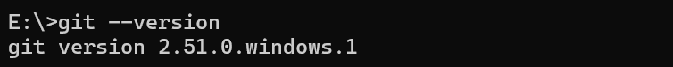
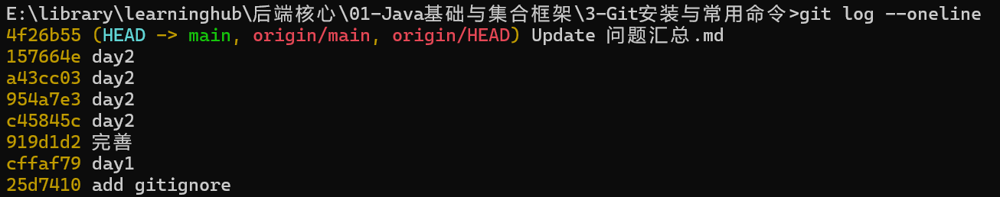

# 3-Git安装与常用命令  

## 一、学什么  

> 1. Git的工作区、暂存区、本地仓库、远程仓库的四区概念  
> 2. 常用命令  
> 3. 远程协作  
> 4. .gitignore  


## 二、做什么  

## 2.1 下载  

到 git-scm.com 下载 Git for Windows 并安装（一路默认），**新开**终端敲 `git --version` 验证



## 2.2 配置信息

配置称呼：`git config --global user.name "你的昵称"`  
配置邮箱：`git config --global user.email "你的邮箱"`  
用 `git config --global --list` 确认。  

## 2.3 使用  

在 GitHub 或 Gitee 新建空仓库 `learn-java`，把模块 1 的练习代码按顺序提交  

```txt
git init //初始化仓库  
git add . //添加所有文件  
git commit -m "feat:集合联系"  //提交  
git branch -M main  //改变分支名  
git remote add origin <仓库地址>  //关联远程仓库  
git push -u origin main  //推送到远程仓库  
```

## 2.4 常用命令   

```txt
git status 查看当前仓库状态  
git log --oneline 查看提交记录  
git branch 查看分支  
git checkout -b dev 创建并切换分支  
git merge 合并分支  
git pull 拉取远端  
git reset --hard <hash>  强制回退  
```

## 2.5 .gitignore文件   

用于指定哪些文件不跟踪  
在仓库根目录写 `.gitignore`，内容至少包含 `target/`、`.idea/`、`*.iml`、`out/`，提交后验证 `git status` 不再显示这些目录。     

## 2.6 commit的标准实践  

Conventional Commits 规范  

```text
<type>[optional scope]: <description>  

[optional body]

[optional footer(s)] 
```

**1. type** 

| type | 含义         |
| :--- | :----------- |
| feat | feature 功能 |
|fix|bug 修复|
|docs|documentation 文档|
|style|代码风格，空格、格式化、分号|
|refactor|代码重构|
|test|测试|
|chore|杂物|
|perf|performance 性能优化|
|ci|CI流水线|

**2. scope** 

描述本次提交影响哪个模块  

```txt
feat(user): 新增用户登录接口  
fix(order): 修复订单计算bug  
```

**3. description** 

简短描述  

**4. body** 

正文  

**5. footer**  

脚注，比如关联 issue  

```txt
feat(contack): 实现集合联系功能  
  
新增集合实体关联逻辑，支持双向关联查询  
- 添加关联中间表  
- 封装查询工具类  
  
Closes #45  
```

  

## 三、实践  

**1.练习仓库已推送到远端且 `git log --oneline` 能看到提交记录**  



**2.讲出工作区/暂存区/本地仓库/远程仓库四者关系**  

工作区就是当前仓库所在的文件夹，本地存储  
通过add进入暂存区，临时存放改动  
本地仓库就是文件夹中的.git文件夹，git的本地数据库，通过commit提交进入本地仓库  
远程仓库就是在远端服务器上的git数据库，通过push推送进入远程仓库  

**3.讲出 `add/commit/push/pull` 各自作用**  

add添加文件进入暂存区  
commit提交修改进入本地仓库  
push推送修改进入远程仓库  
pull拉取远程仓库内容到本地仓库  

## 四、问题  

**1. git怎么撤销最后一次commit** 

```txt
// HEAD~1是上一个提交  

// 未push  
git reset --soft HEAD~1       撤销commit,但是暂存区不变，工作区不变  
git reset (--mixed) HEAD~1    撤销commit,撤销暂存区，工作区不变  
git reset --hard HEAD~1       全部撤销  

// 已push  
git revert HEAD               新建一个提交  
```

**2. merge和rebase的区别**  

merge保留分叉  
rebase是线性的  

**3. 代码冲突怎么解决**  

两个分支修改了同一个文件的同一行代码，git不知道要保留哪一份，这个时候就会发生冲突  
这个时候git会标记冲突的文件中的冲突的地方，手动修改  
